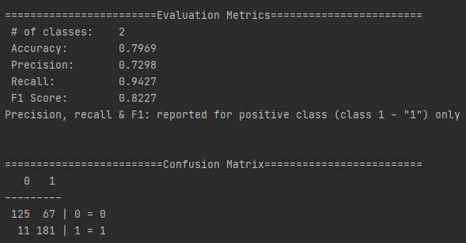
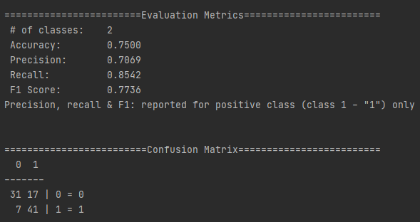

# FaceMaskDetector_Cobra
A small group project about **face mask classification using CNN**.

## Introduction
In these tough COVID-19 times, we decide to build a very simple and basic Convolutional Neural Network (CNN) model to detect if you are wearing a face mask to protect yourself.

## Problem Statement
Studies have proved that wearing a face mask significantly reduces the risk of viral transmission as well as provides a sense of protection. However, it is not feasible to manually track the implementation of this policy.We introduce a Deep Learning based system that can detect instances where face masks are not used properly. Our system consists of a Convolutional Neural Network (CNN) architecture capable of detecting masked and unmasked faces.This will help track safety violations, promote the use of face masks, and ensure a safe working environment.

## The Idea
The main idea is to do a simple image classification either people are wearing a mask or not by using a model which utilizes a CNN architecture. 240 set of images had been used for both training and test set respectively.

## The Journey

### Data Collection
Images has been gathered from various sources but mostly gathered through [Kaggle](https://github.com/adityap27/face-mask-detector) & [Google Image](https://images.google.com/imghp?hl=en&gl=ar&gws_rd=ssl). 240 set of images had been used for both training and test set respectively.

### Data Processing
* Dataset split into 2 class and 2 sets.

| Class        | Training Set  | Test Set  | Total |
| :-------------:|:-------------:| :--------:|:---:  |
| **Mask**     | 192           |   48      | 240   |
| **No Mask**  | 192           |   48      | 240   |
| **Total**    | 384           |   96      | 480   |

###  Architecture and Modeling
Please refer to code in MaskDetectorDataIterator and CNN_Model

###  Evaluation

* Below is the **Evaluation Metrics** for both train and test sets.

| Sets         | Training Set  | Test Set  | 
| :-------------:|:-------------:| :--------:|
| **Accuracy** | 79.69%        |   75.00%  | 
| **Precision**| 72.98%        |   70.69%  | 
| **Recall**   | 94.27%        |   85.42%  | 
| **F1 Score** | 82.27%        |   77.36%  | 

* Below is the screenshot of both **Evaluation Confusion Matrix** for both train and test sets.

#### Train set:

#### Test set:

## Possible Improvement
1. Use more Training Data.
2. Use more Data Augmentation for Training Data.
3. Use Transfer Learning like VGG16 and etc.
4. Can improve the application by doing localization using YOLO and segmentation using U-Net.
